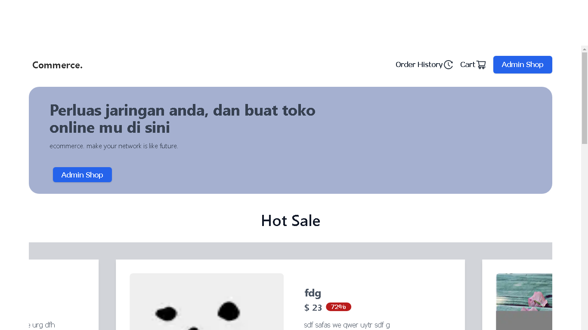
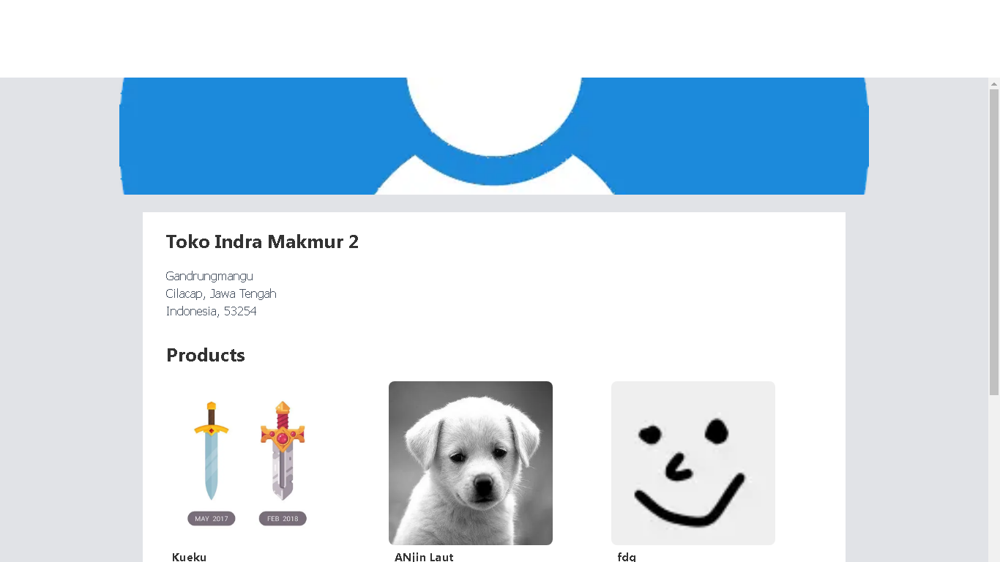

# ECommerce.  Order system with Next js
Ecommerce - Banguan karir anda semakin bagus.

<p float="left">

  

  

</p>

## Feature Application

### User Feature
- Login/Register Account
- Create Shop
- Add product to cart
- Shipping Address
- Placeolder Order
- Commented Product
- Give rating to product

### Admin Shop Feature
- Create/Update/Delete Product
- Approved order

## Usage
First, run the development server:

```bash
npm run dev
# or
yarn dev
```

Open [http://localhost:3000](http://localhost:3000) with your browser to see the result.